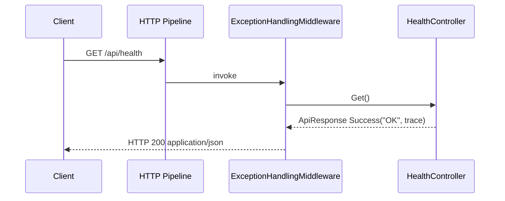
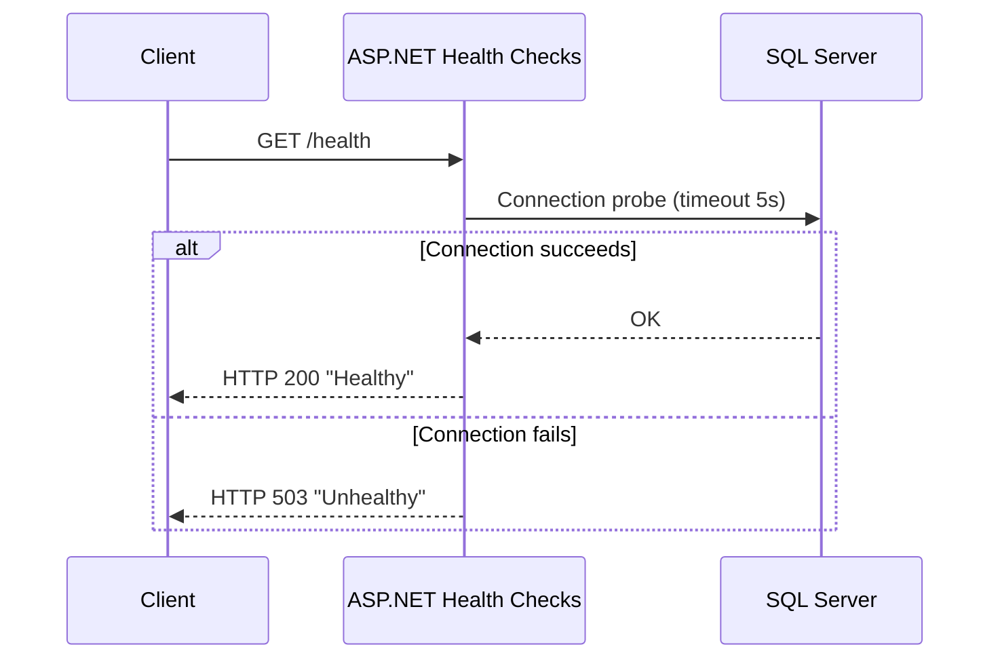
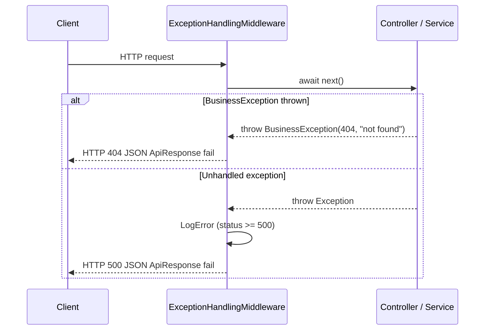
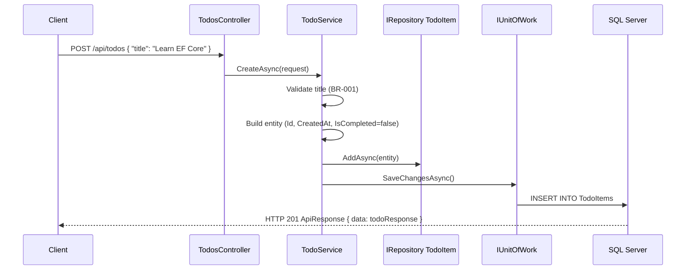
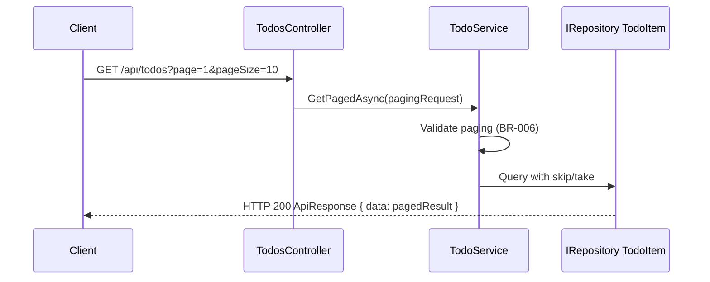
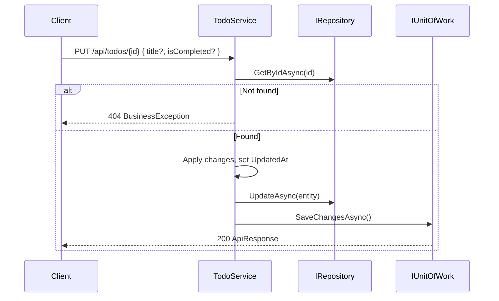

# 03 — User Flows

This document describes **interaction flows** between clients and the API. Flows marked **(implemented)** exist in code today. Flows marked **(planned)** describe the intended design for upcoming Todo CRUD work.

---

## Actors

| Actor | Description |
|-------|-------------|
| **Client** | Browser (Swagger), REST client, curl, PowerShell, future mobile/web app |
| **API** | `NewbieCoder.API` — controllers, middleware, health checks |
| **Service** | Application/business layer **(planned)** |
| **Repository** | `IRepository<T>` + `IUnitOfWork` |
| **Database** | SQL Server — `NewbieCoderDb` |

---

## Flow 1 — Check API is running **(implemented)**

**Trigger:** Client wants to verify the API process responds.

**Endpoint:** `GET /api/health`



**Response body:** Standard envelope — `responseData: "OK"`, `responseStatus.responseCode: "000000"`.

**Notes:**
- Does not verify database connectivity
- Uses standard `ApiResponse<T>` envelope
- Implemented in `HealthController.cs`

---

## Flow 2 — Check database connectivity **(implemented)**

**Trigger:** Monitoring tool or developer verifies SQL Server is reachable.

**Endpoint:** `GET /health`



**Notes:**
- Response is **plain text**, not `ApiResponse` JSON
- Registered in `ServiceCollectionExtensions` via `AddSqlServer(connectionString, name: "sqlserver")`
- Fails if LocalDB is not running or migration not applied

---

## Flow 3 — Global error handling **(implemented)**

Applies to all controller endpoints when an exception is thrown.



**Error JSON shape:**

```json
{
  "success": false,
  "message": "Error description",
  "data": null
}
```

---

## Flow 4 — Create todo **(planned)**

**Endpoint:** `POST /api/todos`



**Expected validations:** BR-001 (title), BR-005 (timestamps)

---

## Flow 5 — List todos with paging **(planned)**

**Endpoint:** `GET /api/todos?page=1&pageSize=10`



Uses existing `PagingRequest` DTO from Core.

---

## Flow 6 — Get todo by id **(planned)**

**Endpoint:** `GET /api/todos/{id}`

- Found → HTTP 200 + `ApiResponse<TodoResponse>`
- Not found → BR-004 → HTTP 404

---

## Flow 7 — Update todo **(planned)**

**Endpoint:** `PUT /api/todos/{id}` or `PATCH /api/todos/{id}`



---

## Flow 8 — Delete todo **(planned)**

**Endpoint:** `DELETE /api/todos/{id}`

- Hard delete per BR-003
- Not found → 404
- Success → HTTP 200 or 204 (choose one convention and document in 05-api-contracts)

---

## Flow 9 — Developer setup **(implemented)**

**Actor:** Developer or agent setting up local environment.

```text
1. Clone repository
2. Run scripts/setup.ps1 (or setup.sh)
   └── dotnet restore → tool restore → build → ef database update
3. dotnet run --project NewbieCoder.API
4. Open Swagger or GET /api/health
5. Optional: GET /health to verify SQL
```

---

## Flow 10 — Docker development **(implemented)**

```text
1. docker compose up -d --build
2. Wait for sqlserver container healthy
3. Run migration from host against localhost:1433
4. Access API at http://localhost:5089/swagger
```

See [README.md](../README.md) for exact connection string and commands.

---

## Client tooling

| Tool | Use case |
|------|----------|
| Swagger UI (`/swagger`) | Manual endpoint testing in Development |
| `NewbieCoder.API.http` | VS / VS Code REST Client snippets |
| `Invoke-RestMethod` / curl | Scripting and smoke tests |
| `WebApplicationFactory` | Automated integration tests |

---

## Agent guidance

- When implementing planned flows, follow sequence: Controller → Service → Repository → UnitOfWork
- Add matching sequence tests in `ApiTests/` and `ServiceTests/`
- Update this document to mark flows as **implemented** and remove **(planned)** label
- Keep `/health` and `/api/health` distinct — do not merge into one endpoint
